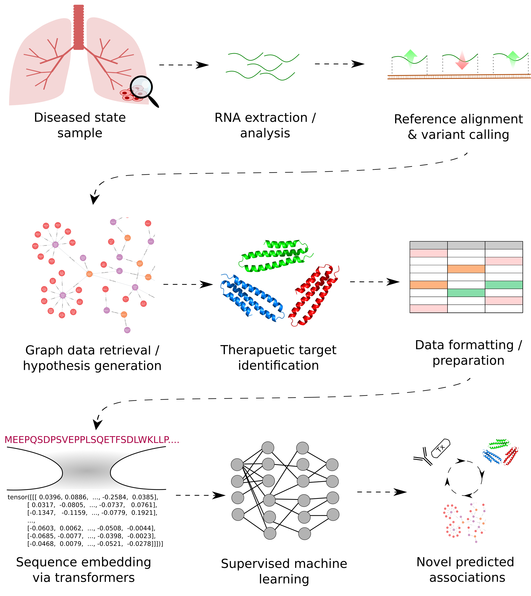

# Rare disease analysis

Rare diseases are conditions that affect a small percentage of the population, typically fewer than 200,000 people in the U.S. or 1 in 2,000 in Europe. This imprecision in the definition makes determining the precise number of "rare diseases", however estimates and curation efforts cite approximately 7000 known diseases.

The low incidence within the general population of these rare diseases make them economically unappealing for traditional drug discovery processes. This unmet need may be overcome through the repurposing of existing drugs to modulate and improve patient outcomes in understudied rare disease areas.

- https://health.ec.europa.eu/medicinal-products/orphan-medicinal-products_en    
- https://www.sciencedirect.com/science/article/pii/S0012369218300643

## Goal/s 

1. Identify therapeutic targets within rare disease associated datasets:
    - Over-expressed proteins relative to WT
    - Aberrant variants associated with disease state
2. End-to-end pipeline able to retrieve relevant target intel based on Tx hypothesis:
    - Automatic retrieval of associated genes based on threshold criteria 
    - Graph database of rare disease ontologies linked to protein IDs
    - Therapeutic intel (known associated drugs, binding data etc.) linked to IDs
3. Supervised learning approaches used to identify opportunities for drug repurposing

## To-do

- Identify potential tractable targets / diseases
- Integrate datasets:
    - Tx intel
        - BindingDB
    - Rare disease datasets
        - Core genomics datasets
- Implement supervised Tx association 

## Graphical abstract

## Tools

### Genomics 
- BWA 
- SAMtools
- NBCFtools
- SNPeff
- Cyvcf2

### Proteomics 
- Pyteomics

### Graph 
- Neo4j

### ML 
- PyTorch
- CUDA
- ESM2

### Misc data / Other
- Pandas

## Datasets

### Genomics 

- DepMap
- SC2disease | Single cell RNA seq data from disease associated cell lines
- ENSEMBL | Core genomes
    - Human reference genome - GRCh38.p14
- ENA (European Nucleotide Archive) | Disease associated datasets for variant calling
    - PRJNA1104541- LAM cell mTOR dysregulation induces IL6 and paracrine AT2 cell senescence impeding lung repair in lymphangioleiomyomatosis. 

### Proteomics

- Uniprot | Core proteomic intel
    - Human proteome
- OpenTargets
    - "Targets"
    - “Interaction”
    - “InteractionEvidence”

### Disease intel / ontology

- Orphanet (ORPHA)
    - https://www.orphadata.com/orphanet-scientific-knowledge-files  
    - A rare disease nomenclature / ontology resource. Contains curated files crossreferencing a subset of rare diseases across different ontologies. 
- Disease Ontology (DOID) | Disease nomenclature / ontology resource
- OpenTargets
    - "associationByOverallDirect"
    - "associationByOverallIndirect"
    - “Disease”